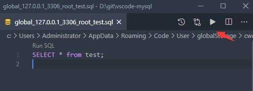

# Database Client for Visual Studio Code(现代化数据库管理工具vscode版)

The website（官网网站）  [https://github.com/ijry/airdb](https://github.com/ijry/airdb).

---

  
  
  
  

 

This project is a database client for VSCode, supports manager **MySQL/MariaDB, PostgreSQL, SQLite, Redis, ClickHouse, 达梦**, and **ElasticSearch**, and works as an **SSH** client, boost your maximum productivity!

【该项目为Visual Studio Code的数据库客户端GUI管理扩展插件, 支持**MySQL/MariaDB, PostgreSQL, SQLite, Redis, ClickHouse, 达梦**以及**ElasticSearch**的管理, 也可以作为一个SSH客户端, 方便对服务器进行运维管理!】

> Project site: [AirDB](https://github.com/ijry/airdb), [中文文档](README_CN.md)

## Features功能

- [Database Client for Visual Studio Code(现代化数据库管理工具vscode版)](#database-client-for-visual-studio-code现代化数据库管理工具vscode版)
  - [Features功能](#features功能)
  - [Installation安装扩展](#installation安装扩展)
  - [Connect连接数据库](#connect连接数据库)
  - [Table数据表管理](#table数据表管理)
  - [Execute SQL Query执行SQL查询](#execute-sql-query执行sql查询)
  - [Cache缓存机制](#cache缓存机制)
  - [Backup/Import导入导出数据](#backupimport导入导出数据)
  - [Setting设置](#setting设置)
  - [Filter表过滤](#filter表过滤)
  - [Generate Mock Data生成测试数据](#generate-mock-data生成测试数据)
  - [History历史记录](#history历史记录)
  - [Credits致谢](#credits致谢)

## Installation安装扩展

Install from vscode marketplace（在 Visual Studio Code 扩展中心安装） [airdb](https://marketplace.visualstudio.com/items?itemName=jry.airdb).

## Connect连接数据库

1. Open Database Explorer panel, then click the `+` button.(打开左侧数据库面板, 点击添加按钮。)
2. Select your database type, input connection config then click the connect button.(在连接页面配置相应的数据库信息。)
   

Two panels are created because in some cases you need to view both SQL and NoSQL data at the same time, you can drag the panel to the other by long-pressing.
（创建两个面板是因为部分情况下你需要同时查看SQL和NoSQL的数据, 可通过长按拖动面板到另一个里面。）

## Table数据表管理

1. Click table to open table view.（点击数据库表打开数据页）
2. Click button beside table to open new table view.（点击表旁边的按钮则是打开新的数据页）
3. Then you can do data modification on the table view.（之后就可在页面进行CRUD、数据导出(**Excel、JSON**)等操作。）

## Execute SQL Query执行SQL查询

In the Database Explorer panel, click the `Open Query` button.（点击数据库节点的 `Open Query` 按钮.）

That will open a SQL editor bind of database, it provider:（将会打开新的SQL编辑器, 可编辑和执行SQL, 提供了以下功能：）

1. IntelliSense SQL edit.【SQL自动补全】
2. snippets:`sel、del、ins、upd、joi`...【片段:`sel、del、ins、upd、joi.`】
3. Run selected or current cursor SQL (Shortcut : Ctrl+Enter). 【 执行已选择或当前光标SQL (快捷键: Ctrl+Enter)】
4. Run all SQL (Shortcut : Ctrl+Shift+Enter).【执行全部SQL (快捷键: Ctrl+Shift+Enter)】

Note: The extension is developed using Nodejs. Nodejs does not allow duplicate name attributes, so you need to avoid columns with the same name in your query, otherwise the results will not be displayed in full.

【注意: 扩展由Nodejs开发, Nodejs不支持同名属性, 所以你需要避免在你的查询中出现同名列, 否则结果无法显示完整。】

This extension supports codelen, but does not support stored procedures and functions. If you use them frequently, it is recommended to disable codelen.

【该扩展支持了codelen, 但不支持存储过程和函数, 如果你经常使用他们, 则建议禁用codelen。】

## Cache缓存机制

In order to improve performance, the database information is cached. If your database structure changes externally, you need to click the refresh button to refresh the cache。

【为了提高性能，缓存了数据库信息，如果你的数据库结构在外部发生了变更，需要点击以下按钮刷新缓存。】

## Backup/Import导入导出数据

Move to ant DatabaseNode or TableNode. The export/import options are listed in the context menu (right click to open).

The extension implements the backup function, but it is not stable enough. You can add mysql_dump or pg_dump to the environment variable, and the extension will use these tools for backup.

【在表或者数据库节点右击, 之后便可以进行数据的导入导出; 扩展实现了备份功能, 但不够稳定, 可将mysql_dump或pg_dump加到环境变量, 扩展就会使用这些工具进行备份。】

## Setting设置

This extension contain some setting, can be modified as follows.

The default settings can get the best experience, don't worry

【该扩展包含一些设置, 可通过以下方式进行设置, 一般默认的设置就可以得到最好的使用体验。】

## Filter表过滤

Used to quickly filter the table, if there is an input box to simplify the search operation, but unfortunately VSCode does not support this function.【用于快速筛选表, 如果有输入框可简化搜索操作, 但不幸的是VSCode并不支持该功能。】

## Generate Mock Data生成测试数据

You can easily generate test data.

【该扩展提供一键生成虚拟数据的功能, 再也不用为没有测试数据而烦恼。】

## History历史记录

Click the history button to open the list of recently executed query history records.

【点击历史记录按钮后可查看以往执行的Sql记录。】

## Credits致谢

- [DatebaseClient](https://github.com/cweijan/vscode-database-client) 数据库客户端插件（本项目基于此项目开发）.
- [sql-formatter](https://github.com/zeroturnaround/sql-formatter) Sql format lib（Sql格式化库）.
- [umy-ui](https://github.com/u-leo/umy-ui): Result view render（表数据渲染库）.
- [ssh2](https://github.com/mscdex/ssh2): SSH client（SSH连接库）.
- Client Lib:
  - [node-mysql2](https://github.com/sidorares/node-mysql2) : MySQL client（MySQL连接库）.
  - [node-postgres](https://github.com/brianc/node-postgres): PostgreSQL client（PostgreSQL连接库）.
  - [tedious](https://github.com/tediousjs/tedious): SqlServer client（SqlServer连接库）.
  - [ioredis](https://github.com/luin/ioredis): Redis client（Redis连接库）.
  - [vscode-sqlite](https://github.com/AlexCovizzi/vscode-sqlite): SQLite client code reference（ SQLite连接代码参考）.
